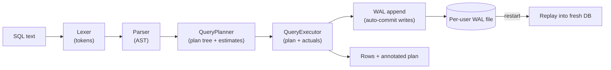

# Architecture

One page on how a query moves through SQL Playground, and the three decisions that matter. Every claim below is backed by a test, a benchmark CSV, or a demo script in this repo.



A request hits `POST /api/query` (`SqlController`), which runs lex → parse → plan → execute in that order, then returns rows plus the plan annotated with actual row counts.

## 1. Parsing: hand-rolled lexer and recursive-descent parser

No parser generator. The `Lexer` tokenizes keywords, literals, and operators; the `Parser` builds an AST (`AstNode`) with one node type per statement and clause, including `CREATE INDEX`, `BEGIN`/`COMMIT`/`ROLLBACK`, and `ANALYZE`. Grammar gaps surface as precise errors — an unsupported constraint fails at a named token, not a NullPointerException — which is why `NOT NULL` enforcement could be added in the parser, the column metadata, and the write path independently.

## 2. Logical → physical plan, informed by statistics

The planner first builds the logical shape (scan → joins → filter → aggregate → sort → limit → project), then makes two physical choices from `StatisticsManager` data (row counts, per-column NDV, min/max):

- **Access path**: equality on an indexed column becomes an `INDEX_SCAN` (B-tree lookup); anything else stays a `SEQ_SCAN`.
- **Join strategy**: the smaller input is the build side; at or above **200 build-side rows** the node becomes `HASH_JOIN`, otherwise `NESTED_LOOP_JOIN`. Join output is estimated with classic `1/max(ndv)` equi-join selectivity, so the number moves when statistics go stale — the Plan tab shows estimate vs actual side by side to make that visible.

## 3. Execution with receipts

The executor walks the same stage order and records actual rows per stage into a per-request profile, which the controller stamps back onto the plan tree. A plan node therefore carries both what the optimizer believed (`estimatedRows`, `selectivity`) and what happened (`actualRows`), plus a plain-language `summary` on joins naming the strategy, build/probe sides, and the threshold math. If execution ever disagrees with the plan (e.g. a different join strategy), it is recorded as `actual_strategy`, not hidden.

## 4. WAL write path and recovery

Every auto-commit INSERT/UPDATE/DELETE and every DDL statement is appended to a per-user WAL file (flushed per append) *before* it is applied. On restart the log replays in sequence order into a fresh database. In-transaction writes never reach the log — they live only in MVCC version chains — so a crash loses exactly the uncommitted work and replay needs no undo pass. Proven, not asserted: `mvn test -Dtest=WalCrashRecoveryTest` and `./bench/crash-demo.sh` (real `kill -9`, real restart) pin committed-present and in-flight-absent. One honest gap, pinned by test: `COMMIT` flips status without flushing, so explicit-transaction writes are not yet crash-durable; auto-commit durability is unaffected.

## Why these three decisions

1. **200 rows is a measured threshold, not a round number.** The forced-strategy benchmark (`backend/bench/join-benchmark.csv`) shows hash join ahead at every measured size — 1.3x at 10 rows, 3.8x (296 ms → 78 ms) at 100k rows, ~1,100x when the build side itself reaches 2,000 rows. 200 sits comfortably on the side where hash has already won, with margin for wider rows and slower disks. The threshold is one constant (`HASH_JOIN_THRESHOLD`) shared by planner and executor, so the two can never disagree about the rule — only about the inputs, which is itself surfaced.
2. **Estimates and actuals travel together.** Most engines make you trust the plan or re-run with instrumentation. Here every response carries both, because the plan/actual delta is the cheapest possible signal that statistics are stale — and stale statistics are the normal state of any database that accepts writes between `ANALYZE` runs.
3. **The WAL logs the commit boundary, not the operation stream.** Logging only auto-commit writes keeps the log exactly equal to the durable prefix of history: replay is a straight re-application with no undo phase and no transaction table to reconcile. The price is explicit: uncommitted work is simply absent after a crash, by construction rather than by cleanup.

## Stretch differentiator: snapshot isolation (Option A)

Of MVCC snapshot reads, result caching, and a columnar engine, this project picked snapshot isolation — deliberately. It builds on the MVCC machinery already here (row-version chains, session transactions, visibility rules) instead of bolting on an unrelated subsystem; a cache would add a benchmark number of thin interview value, and a columnar engine cannot be done *well* in a single pass. Every transaction captures the commit sequence at `BEGIN` and only sees versions committed within its snapshot, so concurrent commits never move an open transaction's view:

```
-- session A                          -- session B
BEGIN;                                 BEGIN;
SELECT * FROM departments;  → 3       INSERT INTO departments ... 'Legal';
SELECT * FROM departments;  → 3         COMMIT;
                                       -- (meanwhile, fresh readers see 4)
```

`mvn test -Dtest=SnapshotIsolationTest` pins repeatable reads, self-visibility, rollback invisibility, and post-snapshot deletes staying visible. Two deliberately narrow semantics, stated plainly: auto-commit writes bypass versioning and are visible immediately (consistent with the WAL boundary above), and true parallel-thread safety of the in-memory structures remains future work — the guarantee proven here is snapshot *semantics* under interleaved sessions, tested deterministically rather than by racy thread timing.
