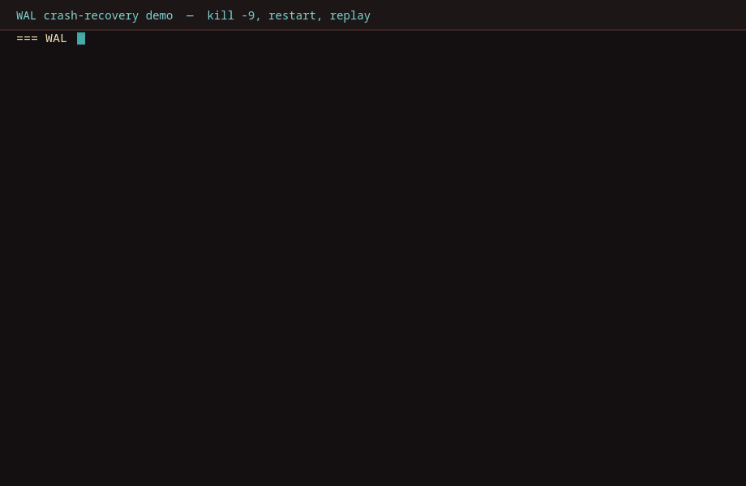

# SQL Playground — Custom Java Query Engine

[](https://github.com/sapppu/sql-playground/actions/workflows/ci.yml)

A full-stack SQL playground backed by a hand-written Java SQL engine.
Zero external databases, no Docker, no cloud dependencies.

## Architecture

```
Browser (React + Vite :3000)
    │
    ├── POST /api/query   → Lexer → Parser → Planner → Executor
    ├── GET  /api/schema  → In-memory table catalog
    └── POST /api/schema/reset → Reseed sample data

Backend (Spring Boot :8081)
    ├── Lexer         — tokenises raw SQL
    ├── Parser        — recursive descent → AST
    ├── QueryPlanner  — cost-based execution plan tree
    ├── QueryExecutor — walks AST, evaluates against in-memory tables
    └── InMemoryDatabase — ConcurrentHashMap-backed table store
```

> The one-page design walkthrough — parsing, planning, the measured 200-row join threshold, execution receipts, and WAL recovery — lives in [ARCHITECTURE.md](ARCHITECTURE.md).

## Prerequisites (Ubuntu)

```bash
sudo apt update
sudo apt install openjdk-17-jdk maven nodejs npm
java -version    # should show 17
mvn -version
node --version   # should show 18+
```

## Run the backend

```bash
cd sql-playground/backend
mvn spring-boot:run
# Starts on http://localhost:8081
# Sample data (employees, departments, products) seeded automatically
```

## Run the frontend

```bash
cd sql-playground/frontend
npm install
npm run dev
# Opens on http://localhost:3000
# Sign up for a local account when prompted — the backend must be running
```

## Run locally with Docker

The only step needed:

```bash
docker compose up --build
# Frontend on http://localhost:3000, API on http://localhost:8081
```

What this starts: a `backend` service (multi-stage `backend/Dockerfile` — Maven+JDK build, slim JRE runtime) and a `frontend` service (`frontend/Dockerfile` — Vite build served by nginx, `/api/*` reverse-proxied to the backend so the browser stays same-origin). App data persists in the `sqlplayground-data` volume. Knobs via environment: `FRONTEND_PORT`, `BACKEND_PORT`, `JWT_SECRET` (change this in any shared deployment), `VITE_API_URL` (empty keeps same-origin calls).

## Live demo

No public URL yet — deploying needs one authenticated click that only the repo owner can do:

1. Push this repo to GitHub (already at `github.com/sapppu/sql-playground`).
2. In [Render](https://render.com): New → Blueprint → select the repo. `render.yaml` provisions the Docker backend plus the static frontend (already wired: `VITE_API_URL` points at the backend, free plans for both).
3. Open the frontend URL, sign up, create a table, run a query, check the Plan tab, toggle the theme.
4. Paste the frontend URL here as the live demo link.

Free-tier note: Render spins the backend down after inactivity, so the first request after idle takes ~30–60s to wake up.

## Supported SQL

| Statement        | Example |
|-----------------|---------|
| SELECT           | `SELECT name, salary FROM employees WHERE salary > 80000` |
| WHERE            | `=  !=  <  >  <=  >=  AND  OR  NOT  LIKE  IS NULL  IN (...)` |
| ORDER BY         | `ORDER BY salary DESC, name ASC` |
| LIMIT / OFFSET   | `LIMIT 5 OFFSET 10` |
| GROUP BY + agg   | `SELECT dept, COUNT(*), AVG(salary) FROM employees GROUP BY dept` |
| DISTINCT         | `SELECT DISTINCT department FROM employees` |
| Functions        | `UPPER()  LOWER()  LENGTH()  ABS()  ROUND()  COUNT()  SUM()  AVG()  MAX()  MIN()` |
| CREATE TABLE     | `CREATE TABLE t (id INTEGER PRIMARY KEY, name VARCHAR NOT NULL)` |
| INSERT           | `INSERT INTO t (name) VALUES ('Alice')` |
| UPDATE           | `UPDATE employees SET salary = 99000 WHERE name = 'Alice'` |
| DELETE           | `DELETE FROM employees WHERE active = false` |
| DROP TABLE       | `DROP TABLE students` |
| JOIN             | `SELECT employees.name, departments.budget FROM employees JOIN departments ON employees.department = departments.name` |
| Transactions     | `BEGIN` `COMMIT` `ROLLBACK` |
| CREATE/DROP INDEX| `CREATE INDEX idx_salary ON employees (salary)` |
| ANALYZE          | `ANALYZE employees` |

## Frontend features

- **Schema browser** — expandable table/column tree with types and PK/NN/IDX indicators
- **SQL editor** — Monaco editor with schema-aware autocomplete, Ctrl+Enter to run
- **Example queries** — one-click query bar with 8 sample statements
- **Results tab** — scrollable grid with type-aware cell colouring
- **Plan tab** — interactive execution plan tree (expandable nodes with cost stats, per-node stats drawer with estimated-vs-actual rows, join strategy badges)
- **Tokens tab** — colour-coded token stream from the Java lexer
- **Reset button** — restores all sample data in one click
- **Analyze all button** — recomputes table statistics for the planner

## Benchmark: nested_loop vs hash_join

Forced-strategy A/B on the same join (`bench_emp JOIN bench_dept ON department = name`), 5 timed plan+execute runs per cell after 2 warmups, medians reported. Strategies are forced via a bench-only planner override so the comparison is fair; both strategies assert identical result sets on every run. Raw data: [`backend/bench/join-benchmark.csv`](backend/bench/join-benchmark.csv) — regenerate with `mvn test -Dtest=JoinBenchmark -Dbench=1` from `backend/`.


| Employees | nested_loop | hash_join | Faster |
|----------:|------------:|----------:|--------|
| 1,000 | 5.83 ms | 3.79 ms | hash, 1.5x |
| 10,000 | 25.26 ms | 16.18 ms | hash, 1.6x |
| 100,000 | 295.59 ms | 78.33 ms | hash, 3.8x |

Varying the build side (2,000 employees, departments swept 10 → 2,000) shows why the planner's 200-row threshold is conservative rather than exact: hash_join leads at every measured size, from 6.7x at 10 build rows to ~1,100x (2,442 ms → 2.23 ms) at 2,000. No crossover was observed down to 10 rows — the threshold never picks a slower strategy in the measured range.

Environment: OpenJDK 17.0.20, 16-core Linux, default Maven/Surefire JVM flags. Numbers are machine-specific; rerun the command above to reproduce.

Resume line: reduced 100k-row join latency 74% (296 ms → 78 ms) by implementing a cost-based hash-join optimizer with NDV-driven cardinality estimates.

## Crash recovery: WAL replay across kill -9

Every mutation is appended to a per-user write-ahead log (flushed on each append) before it is applied. Only auto-commit writes and DDL reach the log — in-transaction writes live solely in MVCC version chains — so a crash replays exactly the committed prefix: committed rows come back, in-flight rows do not, with no undo pass required.



Reproduce it in one command (isolated port + data dir, your dev backend untouched):

```bash
# fast, no server needed — crash simulated against a real WAL file:
mvn test -Dtest=WalCrashRecoveryTest   # from backend/

# full fidelity — real backend, real kill -9, real restart:
./bench/crash-demo.sh                  # from backend/
```

What the demo asserts: an auto-commit `INSERT` issued before `kill -9` is returned by `SELECT` after the restart; a `BEGIN` + `INSERT` that never commits is gone, and its row never appears in any WAL file. Writes are flushed per append, so this survives process crashes (not OS/power loss — no fsync).

Known limitation, pinned by test: `COMMIT` currently only flips transaction status and does not flush the transaction's writes to the WAL, so even committed-transaction writes are lost on restart. Auto-commit durability is unaffected. Fixing commit-flush is the natural next step.

## Sample queries to try

```sql
-- Aggregation
SELECT department, COUNT(*), AVG(salary), MAX(salary)
FROM employees
GROUP BY department

-- Multi-condition filter
SELECT name, salary
FROM employees
WHERE salary > 80000 AND active = true
ORDER BY salary DESC

-- String functions
SELECT UPPER(name), LENGTH(name) FROM employees

-- Create and populate
CREATE TABLE courses (id INTEGER PRIMARY KEY, title VARCHAR NOT NULL, credits INTEGER)
INSERT INTO courses (title, credits) VALUES ('Algorithms', 4)
SELECT * FROM courses
```
